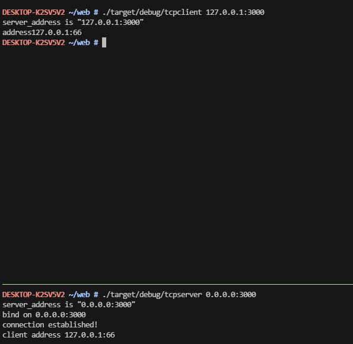

# IpServer
## Use
### Server
```
  cargo build
  ./target/debug/tcpserver --help
  ./target/debug/tcpserver 0.0.0.0:3000
```
### Client
```
  cargo build
  ./target/debug/tcpclient --help
  ./target/debug/tcpclient 127.0.0.1:3000
```
### Short

